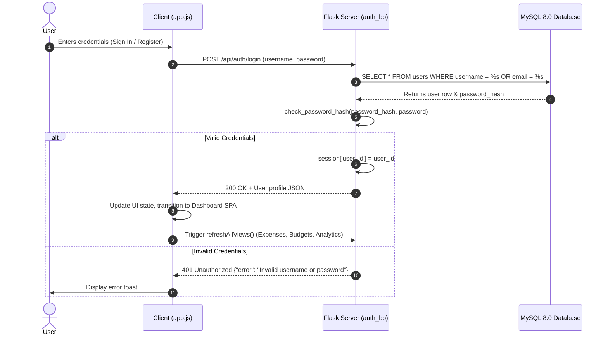
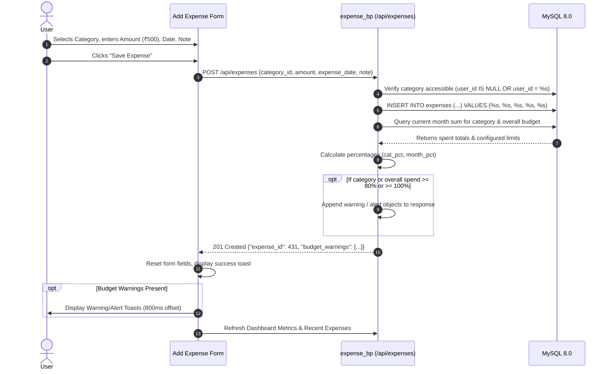
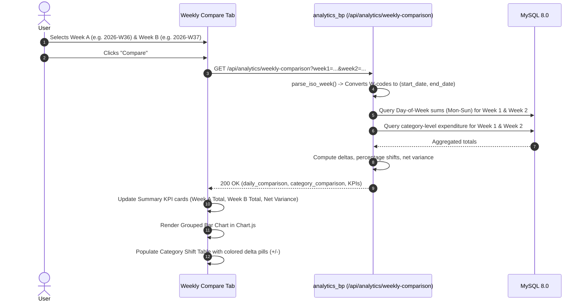
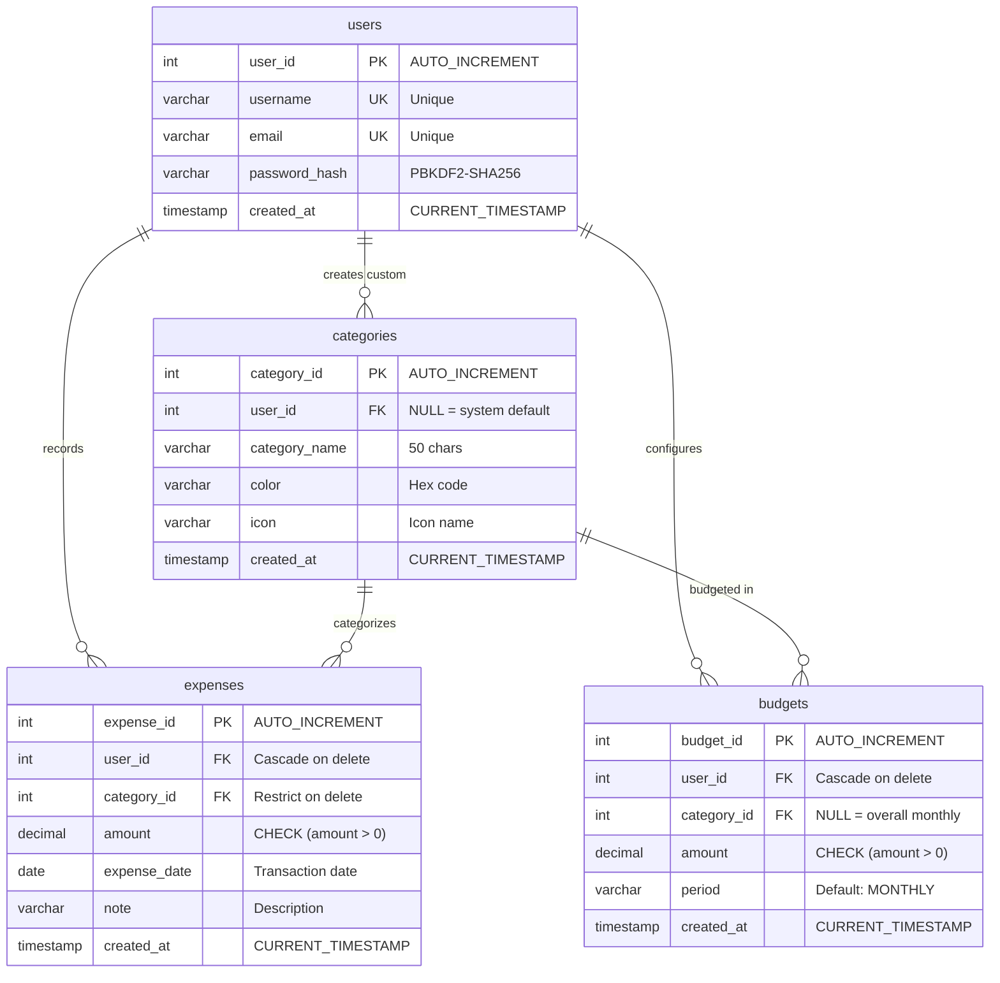

# 💰 Personal Expense Tracker & Financial Analytics

[](https://www.python.org/)
[](https://flask.palletsprojects.com/)
[](https://www.mysql.com/)
[](https://getbootstrap.com/)
[](https://www.chartjs.org/)
[](https://www.docker.com/)
[](https://aws.amazon.com/ec2/)

A robust, secure, full-stack personal finance web application engineered with **Python (Flask)**, **MySQL 8.0**, **Bootstrap 5.3**, **Chart.js**, and **Vanilla JavaScript (ES6+)**. 

Designed with a clean single-page application (SPA) architecture, the application empowers users to record daily expenses, configure category-level and overall monthly spending limits with proactive threshold warnings, compare spending shifts across calendar weeks, analyze spending distributions through interactive charts, and inspect spending intensity on a calendar heatmap.

---

## 📑 Table of Contents

1. [Key Features](#-key-features)
2. [End-to-End Application Flow](#-end-to-end-application-flow)
3. [System Architecture & Tech Stack](#-system-architecture--tech-stack)
4. [Project Directory & File Catalog](#-project-directory--file-catalog)
5. [In-Depth Code Explanation](#-in-depth-code-explanation)
6. [Database Schema, Constraints & Indexes](#-database-schema-constraints--indexes)
7. [API Endpoints Reference](#-api-endpoints-reference)
8. [Local Installation & Setup](#-local-installation--setup)
9. [Docker & Containerized Deployment](#-docker--containerized-deployment)
10. [Automated AWS EC2 Deployment](#-automated-aws-ec2-deployment)
11. [Security & Injection Immunity](#-security--injection-immunity)
12. [Technical Evaluation & Viva Q&A](#-technical-evaluation--viva-qa)

---

## 🌟 Key Features

| Feature | Description |
| :--- | :--- |
| 🔐 **Multi-User Authentication** | User registration and login protected with **PBKDF2-SHA256** password hashing (1,000,000 iterations), Flask server-side session management, and HTTP status codes (`401 Unauthorized`). |
| 🏷️ **User-Isolated Categories** | System default categories (Food, Rent, Utilities, Transport, Entertainment, Healthcare) plus user-created custom categories with automatic vibrant color assignment. Custom categories are isolated to their owner. |
| 💸 **Expense Tracking & Management** | Add expenses with validation (positive amount, date selection, category assignment, optional description notes). Instant deletion with confirmation dialogs. |
| ⚠️ **Proactive Budget Warning Engine** | Configure overall monthly limits and individual category limits. Features a dual-tier alert system: **Warning at 80% consumption** and **Danger alert at 100% exceeded**. Checked both in real-time when submitting an expense and on the Budgets dashboard. |
| 📊 **Weekly Comparison Analytics** | Compare expenditure between any two ISO-8601 calendar weeks (e.g., `2026-W37` vs `2026-W38`). Visualized with a grouped day-of-week bar chart (Mon–Sun), category spend delta table, and net difference percentages. |
| 🥧 **Interactive Category Distribution** | Chart.js doughnut chart breaking down spending by category. Supports 4 timeframes: **Daily**, **Weekly**, **Monthly**, and **Custom Date Range** with percentage progress bars and transaction counters. |
| 📅 **Expense Calendar Heatmap** | Interactive monthly calendar view displaying day-by-day expenditure, item count, and dynamic heat intensity levels (0–4). Clicking any date opens a drilldown modal to view transactions or record an expense on that date. |
| 🎨 **Design System & Zero Emojis** | Professional light UI powered by [`static/css/variables.css`](static/css/variables.css) design tokens. Uses 100% vector SVG Bootstrap Icons, accessible input validation, and animated confirmation toasts. |

---

## 🔄 End-to-End Application Flow

### 1. User Authentication & Session Lifecycle


### 2. Expense Recording & Live Budget Alert Verification


### 3. Weekly Comparison Flow


---

## 🏗️ System Architecture & Tech Stack

The application adheres to a decoupled **3-Tier Architecture**:

```text
┌─────────────────────────────────────────────────────────────────────────┐
│                           PRESENTATION TIER                             │
│  Single Page Application (SPA) • HTML5 Semantic Layout                 │
│  Bootstrap 5.3.3 • Bootstrap Icons (Vector SVG Font)                    │
│  static/css/variables.css (Centralized Design System Tokens)            │
│  static/css/style.css (Slim Components & Animations)                    │
│  Chart.js 4.4.1 (Doughnut Charts & Grouped Bar Charts)                  │
│  static/js/app.js (State Machine, Real-time Validation, Async Fetch)    │
└────────────────────────────────────┬────────────────────────────────────┘
                                     │ JSON REST API (HTTP / Fetch)
┌────────────────────────────────────▼────────────────────────────────────┐
│                           APPLICATION TIER                              │
│  Python 3.10+ • Flask 3.0 Web Framework                                 │
│  Modular Blueprints:                                                    │
│    ├── auth_bp      (/api/auth/*)       - Authentication & Sessions     │
│    ├── expense_bp   (/api/expenses/*)   - Expenses CRUD & Dashboard     │
│    ├── category_bp  (/api/categories/*) - System & Custom Categories    │
│    ├── budget_bp    (/api/budgets/*)    - Monthly Limits & Warnings     │
│    └── analytics_bp (/api/analytics/*)  - Weekly & Category Analytics   │
│  Authentication Decorator (@login_required)                             │
│  Werkzeug Security (PBKDF2-SHA256 Password Hashing)                     │
│  DBUtils.PooledDB Connection Pool Manager (Thread-safe pool)            │
└────────────────────────────────────┬────────────────────────────────────┘
                                     │ Parameterized Queries (%s)
┌────────────────────────────────────▼────────────────────────────────────┐
│                              DATA TIER                                  │
│  MySQL 8.0 Relational Database (InnoDB Engine, UTF-8 MB4)               │
│  Tables: users • categories • expenses • budgets                        │
│  Referential Integrity (Foreign Keys with ON DELETE CASCADE / RESTRICT) │
│  Performance Indexing (idx_expense_user_date, idx_expense_category)     │
└─────────────────────────────────────────────────────────────────────────┘
```

### Technology Matrix

| Layer | Component | Version | Role & Justification |
| :--- | :--- | :--- | :--- |
| **Backend Framework** | Flask | `3.0.0` | Lightweight, unopinionated Python micro-framework supporting clean Blueprint routing. |
| **WSGI Server** | Gunicorn | `22.0.0` | High-performance production WSGI HTTP server running multi-worker processes. |
| **Database Engine** | MySQL | `8.0` | Production ACID-compliant RDBMS with InnoDB row-level locking and date indexing. |
| **Database Driver** | PyMySQL | `1.2.0` | Pure-Python client implementing Python DB-API 2.0. |
| **Connection Pool** | DBUtils (`PooledDB`) | `3.2.0` | Thread-safe connection pool preventing connection starvation and eliminating TCP latency. |
| **Password Security** | Werkzeug | `3.1.8` | Cryptographically secure PBKDF2 hashing with salt. |
| **UI Framework** | Bootstrap | `5.3.3` | Responsive layout, modern components, clean utility classes. |
| **Vector Icons** | Bootstrap Icons | `1.11.3` | Scalable vector SVG icon font without reliance on low-resolution emojis. |
| **Data Visualizations**| Chart.js | `4.4.1` | Canvas-rendered interactive charts (doughnut category distributions & grouped weekly bars). |
| **Styling Tokens** | CSS Variables | Native CSS | Modular token architecture for colors, radii, shadows, and spacing. |
| **Reverse Proxy** | Nginx | Stable | Production reverse proxy, SSL termination, and high-speed static asset caching. |

---

## 📂 Project Directory & File Catalog

```text
personal-expense-tracker/
│
├── database/
│   ├── connection.py            # MySQL PooledDB connection pool & get_db_cursor context manager
│   ├── schema.sql               # Clean MySQL 8.0 DDL (Tables, Foreign Keys, Indexes)
│   └── seed.sql                 # Starter seed data (Default categories, demo users, 2026 expenses)
│
├── deploy/
│   ├── expense-tracker.service  # Systemd service unit for Gunicorn production daemon
│   └── nginx.conf               # Nginx reverse proxy configuration & static asset caching
│
├── routes/
│   ├── auth_routes.py           # User sign in, registration, session checks, logout (@login_required)
│   ├── expense_routes.py        # Expense CRUD, dashboard KPIs, and monthly calendar heatmap API
│   ├── category_routes.py       # Default system categories & custom user-created category management
│   ├── budget_routes.py         # Overall monthly limits, category limits, and threshold warning engine
│   └── analytics_routes.py      # Weekly comparison analytics (ISO weeks) & Category Pie chart data
│
├── static/
│   ├── css/
│   │   ├── variables.css        # CSS Custom Properties (:root design tokens, colors, elevation)
│   │   └── style.css            # Component styles, responsive sidebar, calendar grid, animations
│   └── js/
│       └── app.js               # Client-side SPA controller, event listeners, Chart.js integrations
│
├── templates/
│   └── index.html               # Single Page Application HTML5 template with semantic sections
│
├── .dockerignore                # Excludes venv, git, and local cache from Docker builds
├── .env                         # Local environment variables (DB credentials, SECRET_KEY)
├── .env.example                 # Example template for environment configuration
├── .gitignore                   # Git ignore patterns for Python, venv, and IDE files
├── app.py                       # Flask server entry point & blueprint registration
├── config.py                    # Environment variable configuration loader (python-dotenv)
├── Dockerfile                   # Production Python 3.11-slim Docker container image
├── docker-compose.yml           # Multi-container orchestration (MySQL 8.0 + Flask/Gunicorn)
├── requirements.txt             # Pinned Python package dependencies
├── setup_ec2.sh                 # 1-click automated AWS EC2 Ubuntu deployment script
├── DEPLOYMENT_GUIDE.md          # Step-by-step manual AWS EC2 deployment documentation
└── README.md                    # Comprehensive project documentation
```

### Detailed File Catalog

| File Path | Description & Architectural Responsibility |
| :--- | :--- |
| [`app.py`](app.py) | Application root. Initializes Flask, attaches secret keys and session lifetimes, registers all 5 API Blueprints (`auth_bp`, `category_bp`, `expense_bp`, `budget_bp`, `analytics_bp`), serves `index.html`, and starts development server. |
| [`config.py`](config.py) | Central configuration class. Uses `python-dotenv` to safely parse environment variables (`DB_HOST`, `DB_PORT`, `DB_USER`, `DB_PASSWORD`, `DB_NAME`, `SECRET_KEY`) with production-safe defaults. |
| [`database/connection.py`](database/connection.py) | Implements connection pooling via `DBUtils.pooled_db.PooledDB` (2–10 cached connections). Exposes the `@contextmanager` function `get_db_cursor(commit=False)` which provides automatic commit, rollback on error, and connection return to pool. |
| [`database/schema.sql`](database/schema.sql) | DDL defining the 4 normalized tables (`users`, `categories`, `expenses`, `budgets`), column constraints (`amount > 0`), foreign key relations (`ON DELETE CASCADE`), and performance indexes. |
| [`database/seed.sql`](database/seed.sql) | Comprehensive initial data containing 6 system categories, 3 pre-hashed demo accounts (`aditya`, `mayuri`, `demo`), configured monthly budgets, and 430 realistic expense entries across 2026. |
| [`routes/auth_routes.py`](routes/auth_routes.py) | Handles user authentication. Defines `login_required` decorator, `register()` with duplicate checking and initial budget provisioning, `login()` with hash verification, `logout()`, and `me()` session check. |
| [`routes/category_routes.py`](routes/category_routes.py) | Manages category retrieval (`WHERE user_id IS NULL OR user_id = %s`), custom category creation with palette assignment, and safe category deletion with relational dependency checks. |
| [`routes/expense_routes.py`](routes/expense_routes.py) | Core transaction endpoints: `get_expenses()` (last 50 items), `add_expense()` with live budget threshold checking, `delete_expense()`, `get_dashboard_stats()`, and `get_expense_calendar()`. |
| [`routes/budget_routes.py`](routes/budget_routes.py) | Budget limits management: `get_budgets()` (calculates consumption %, triggers 80% warning and 100% danger alerts), `set_budget()` (`ON DUPLICATE KEY UPDATE`), and `delete_budget()`. |
| [`routes/analytics_routes.py`](routes/analytics_routes.py) | Advanced analytics: `get_weekly_comparison()` (converts ISO `YYYY-Www` weeks, computes day-of-week Mon–Sun distributions, category shifts), and `get_category_pie()` (supports Daily, Weekly, Monthly, Custom intervals). |
| [`static/css/variables.css`](static/css/variables.css) | Central design token repository defining `--primary`, semantic palette (`--color-success`, `--color-danger`, `--color-warning`), surface shades, typography, shadows, and z-index layers. |
| [`static/css/style.css`](static/css/style.css) | Application styles: Sidebar navigation layout, responsive table wrappers, calendar grid cells with heat intensity coloring (`heat-0` to `heat-4`), toast notifications, and modal cards. |
| [`static/js/app.js`](static/js/app.js) | Client SPA controller (1400+ lines): Authentication handlers, client-side input validation, dynamic sidebar tab switching, async CRUD calls, Chart.js instances, calendar rendering, and toast triggers. |
| [`templates/index.html`](templates/index.html) | Single-page HTML5 view. Declares structured views for Sign-In, Dashboard, Weekly Compare, Category Pie, Expense Calendar, Budgets & Limits, and Category Management, plus reusable modals. |
| [`setup_ec2.sh`](setup_ec2.sh) | Executable bash deployment script for fresh AWS Ubuntu EC2 instances. Automates apt installs, MySQL configuration, DDL/seed import, Python venv, Gunicorn service, and Nginx proxy in under 3 minutes. |
| [`deploy/expense-tracker.service`](deploy/expense-tracker.service) | Systemd unit configuration running Gunicorn with 3 worker processes under user `ubuntu`, integrated with Linux `journald`. |
| [`deploy/nginx.conf`](deploy/nginx.conf) | Production Nginx server block acting as a reverse proxy to `127.0.0.1:8000` with direct disk caching for `/static/` files. |
| [`Dockerfile`](Dockerfile) | Multi-stage, lightweight Python 3.11-slim container definition running Gunicorn with 2 workers. |
| [`docker-compose.yml`](docker-compose.yml) | Orchestrates the web application and a dedicated MySQL 8.0 container with persistent data volumes and healthcheck probes. |

---

## 🔍 In-Depth Code Explanation

### 1. Database Connection Pooling (`database/connection.py`)
Rather than opening and closing expensive TCP sockets on each request, the app initializes a thread-safe connection pool on startup:

```python
_pool = PooledDB(
    creator=pymysql,
    maxconnections=10,  # Max active connections allowed
    mincached=2,        # Always keep at least 2 connections open
    maxcached=5,        # Max idle connections stored in pool
    maxshared=3,        # Max shared connections
    blocking=True,      # Wait if pool exhausted instead of erroring
    host=Config.DB_HOST,
    port=Config.DB_PORT,
    user=Config.DB_USER,
    password=Config.DB_PASSWORD,
    database=Config.DB_NAME,
    charset='utf8mb4',
    cursorclass=pymysql.cursors.DictCursor,
    autocommit=False
)
```

The `get_db_cursor` context manager guarantees that all queries safely return their connection to the pool, committing on success and rolling back transactions on any exception:

```python
@contextmanager
def get_db_cursor(commit=False):
    conn = get_connection()
    try:
        with conn.cursor() as cursor:
            yield cursor
            if commit:
                conn.commit()
    except Exception:
        conn.rollback()
        raise
    finally:
        conn.close()  # Returns connection back to pool
```

### 2. Live Budget Warning Engine (`routes/expense_routes.py`)
When a user records a new expense via `POST /api/expenses`, the server immediately performs real-time limit calculations:

```python
# Check category-specific budget
cursor.execute("""
    SELECT b.amount as limit_amt, c.category_name
    FROM budgets b
    JOIN categories c ON b.category_id = c.category_id
    WHERE b.user_id = %s AND b.category_id = %s
""", (user_id, category_id))
cat_budget = cursor.fetchone()

if cat_budget:
    cat_limit = float(cat_budget['limit_amt'])
    cursor.execute("""
        SELECT COALESCE(SUM(amount), 0) as total_cat
        FROM expenses
        WHERE user_id = %s AND category_id = %s
          AND MONTH(expense_date) = MONTH(%s) AND YEAR(expense_date) = YEAR(%s)
    """, (user_id, category_id, expense_date, expense_date))
    new_cat_total = float(cursor.fetchone()['total_cat'])
    cat_pct = round((new_cat_total / cat_limit * 100), 1)

    if cat_pct >= 100:
        budget_warnings.append({
            'level': 'danger',
            'message': f"Alert: You have exceeded your {cat_budget['category_name']} monthly budget! Spent: ₹{new_cat_total:,.0f} / ₹{cat_limit:,.0f} ({cat_pct}%)."
        })
    elif cat_pct >= 80:
        budget_warnings.append({
            'level': 'warning',
            'message': f"Warning: You have reached {cat_pct}% of your {cat_budget['category_name']} monthly budget ({cat_pct}%)."
        })
```

### 3. ISO Week Parsing & Day-of-Week Aggregations (`routes/analytics_routes.py`)
To compare any arbitrary calendar weeks, `parse_iso_week` mathematically computes the starting Monday and ending Sunday dates:

```python
def parse_iso_week(year_week_str):
    parts = year_week_str.upper().split('-W')
    year, week = int(parts[0]), int(parts[1])
    # ISO week 1 always contains Jan 4th
    first_day_of_year = date(year, 1, 4)
    start_of_week1 = first_day_of_year - timedelta(days=first_day_of_year.isoweekday() - 1)
    start_date = start_of_week1 + timedelta(weeks=week - 1)
    end_date = start_date + timedelta(days=6)
    return start_date, end_date
```

The database query leverages MySQL's native `DAYOFWEEK()` function (1=Sun, 2=Mon... 7=Sat) to group expenditures, ensuring clean day-by-day comparison in Chart.js.

### 4. Expense Calendar Heat Intensity Algorithm (`routes/expense_routes.py`)
The calendar view calculates the relative spending density for each day of the month:

```python
# Assign heat levels 0-4 based on percentage of max daily spend
for d, data in days_map.items():
    if max_daily_spend > 0:
        ratio = data['total_amount'] / max_daily_spend
        if ratio > 0.75:   data['heat_level'] = 4  # Deep Red (Very Heavy)
        elif ratio > 0.45: data['heat_level'] = 3  # Light Red / Amber (Heavy)
        elif ratio > 0.20: data['heat_level'] = 2  # Amber (Moderate)
        else:              data['heat_level'] = 1  # Subtle Green (Light)
    else:
        data['heat_level'] = 0                     # No spend
```

---

## 🗄️ Database Schema, Constraints & Indexes



### Constraints and Indexing Strategy
1. **`CHECK (amount > 0)`**: Prevents negative or zero expense entries at the database storage engine layer.
2. **`UNIQUE KEY uq_user_category_budget (user_id, category_id)`**: Ensures each user can have only one budget configuration per category (and one overall monthly limit where `category_id IS NULL`).
3. **`INDEX idx_expense_user_date (user_id, expense_date)`**: Composite index drastically accelerating date-range queries, dashboard metrics, monthly filters, and calendar generation.
4. **`INDEX idx_expense_category (category_id)`**: Optimizes relational joins between expenses and category metadata.

---

## 📡 API Endpoints Reference

All endpoints return JSON responses. Protected endpoints require an active session cookie.

| Method | Endpoint | Auth | Description | Request Body / Query Params |
| :--- | :--- | :---: | :--- | :--- |
| `POST` | `/api/auth/register` | No | Register new user account | `{"username": "...", "email": "...", "password": "..."}` |
| `POST` | `/api/auth/login` | No | Authenticate user session | `{"username": "...", "password": "..."}` |
| `POST` | `/api/auth/logout` | Yes | Destroy current session | *None* |
| `GET` | `/api/auth/me` | No | Fetch active user state | *None* |
| `GET` | `/api/categories` | Yes | Get default & user categories | *None* |
| `POST` | `/api/categories` | Yes | Create custom category | `{"category_name": "...", "color": "#hex", "icon": "tag"}` |
| `DELETE` | `/api/categories/<id>` | Yes | Delete custom category | *None* (Fails if linked expenses exist) |
| `GET` | `/api/expenses` | Yes | Fetch recent 50 expenses | *None* |
| `POST` | `/api/expenses` | Yes | Record new expense | `{"category_id": 1, "amount": 250, "expense_date": "2026-09-17", "note": "Lunch"}` |
| `DELETE` | `/api/expenses/<id>` | Yes | Delete an expense | *None* |
| `GET` | `/api/dashboard` | Yes | Lifetime, monthly, yearly stats | *None* |
| `GET` | `/api/expenses/calendar` | Yes | Daily spending calendar grid | `?year=2026&month=9` |
| `GET` | `/api/budgets` | Yes | Fetch monthly limits & warnings | *None* |
| `POST` | `/api/budgets` | Yes | Set overall or category budget | `{"category_id": null|int, "amount": 15000}` |
| `DELETE` | `/api/budgets/<id>` | Yes | Remove budget limit | *None* |
| `GET` | `/api/analytics/weekly-comparison` | Yes | Compare two ISO weeks | `?week1=2026-W36&week2=2026-W37` |
| `GET` | `/api/analytics/category-pie` | Yes | Category distribution data | `?period=monthly&month=2026-09` |

---

## 💻 Local Installation & Setup

### Prerequisites
- Python 3.10 or higher
- MySQL 8.0 Server
- Git

### Step 1: Clone Repository
```bash
git clone https://github.com/deadshot07447/personal-expense-tracker.git
cd personal-expense-tracker
```

### Step 2: Initialize MySQL Database
Open your MySQL terminal or MySQL Workbench:
```sql
CREATE DATABASE IF NOT EXISTS expense_tracker CHARACTER SET utf8mb4 COLLATE utf8mb4_unicode_ci;
```

Run schema DDL and pre-seeded dataset:
```bash
# Import Table Schema
mysql -u root -p expense_tracker < database/schema.sql

# Import Starter Data (Categories, Demo Users, 430 expenses across 2026)
mysql -u root -p expense_tracker < database/seed.sql
```

### Step 3: Configure Environment Variables
Copy `.env.example` to `.env`:
```bash
cp .env.example .env
```

Configure your MySQL connection details in `.env`:
```ini
DB_HOST=127.0.0.1
DB_PORT=3306
DB_USER=root
DB_PASSWORD=your_mysql_password
DB_NAME=expense_tracker
SECRET_KEY=your_generated_secret_key
```

### Step 4: Virtual Environment & Packages
```bash
# Windows
python -m venv venv
venv\Scripts\activate

# Linux / macOS
python3 -m venv venv
source venv/bin/activate

# Install dependencies
pip install -r requirements.txt
```

### Step 5: Start Local Server
```bash
python app.py
```
Visit: **`http://127.0.0.1:5000`**

#### 🔑 Pre-Seeded Demo Accounts
| Username | Password | Notes |
| :--- | :--- | :--- |
| `aditya` | `aditya123` | Extensive 2026 transaction history, custom categories |
| `mayuri` | `mayuri123` | Multiple categories with active budget limits |
| `demo` | `demo123` | Starter profile for quick testing |

---

## 🐳 Docker & Containerized Deployment

Deploy the complete multi-container stack (Flask Web App + MySQL 8.0) using Docker Compose:

```bash
docker-compose up -d --build
```

The database container automatically initializes using [`database/schema.sql`](database/schema.sql) and [`database/seed.sql`](database/seed.sql).

- Access application at: **`http://localhost:80`**
- Check container health: `docker-compose ps`
- View logs: `docker-compose logs -f`
- Stop containers: `docker-compose down`

---

## ☁️ Automated AWS EC2 Deployment

Deploy directly to an **AWS EC2 Ubuntu (Free-Tier)** instance using our automated 1-click script:

### Step 1: Launch EC2 Instance
1. Launch an EC2 instance on AWS (Ubuntu 22.04 or 24.04 LTS, `t2.micro` or `t3.micro`).
2. Allow inbound **HTTP (Port 80)** and **SSH (Port 22)** in Security Group rules.

### Step 2: Connect & Run Setup
```bash
ssh -i /path/to/key.pem ubuntu@<YOUR-EC2-PUBLIC-IP>
```

Clone the repository and execute [`setup_ec2.sh`](setup_ec2.sh):
```bash
git clone https://github.com/deadshot07447/personal-expense-tracker.git
cd personal-expense-tracker
chmod +x setup_ec2.sh
./setup_ec2.sh
```

The script automatically executes:
- Package updates & installs (`python3-venv`, `mysql-server`, `nginx`, `git`).
- Local MySQL 8.0 configuration with a dedicated user and generated credentials.
- Automatic DDL schema and seed data import.
- Virtual environment creation and dependency installation.
- Creation of Gunicorn systemd service (`expense-tracker.service`).
- Nginx reverse proxy configuration with `/static/` asset caching and proper home folder permissions.

### Management Commands on EC2
```bash
# Check service status
sudo systemctl status expense-tracker

# Restart application
sudo systemctl restart expense-tracker

# View live application logs
sudo journalctl -u expense-tracker -f

# Check Nginx status
sudo systemctl status nginx
```

---

## 🛡️ Security & Injection Immunity

1. **Zero SQL Injection Risk**: All database queries strictly utilize parameterized bind variables (`%s`). String interpolation (`f"..."`), formatting (`.format()`), and concatenation are strictly prohibited.
2. **Cryptographic Password Storage**: Plaintext passwords are never saved. Passwords are salted and hashed using PBKDF2 with SHA-256 (`werkzeug.security`).
3. **Session Guards**: API routes enforce authentication through the `@login_required` decorator, protecting user data from unauthorized access.
4. **Isolated Category Ownership**: Queries enforce `WHERE user_id IS NULL OR user_id = %s`, guaranteeing that custom categories are inaccessible to other registered users.

---

## 🎓 Technical Evaluation & Viva Q&A

### Q1: Why use MySQL 8.0 over SQLite or NoSQL (MongoDB)?
> **Answer:** Personal finance data is inherently relational and requires strict ACID compliance. SQLite lacks support for multi-user concurrency and connection pooling in multi-worker WSGI environments. MongoDB lacks built-in relational constraints (like foreign key cascades). MySQL 8.0 provides InnoDB row-level locking, foreign key enforcement, performant date indexing, and robust multi-user connection pooling.

### Q2: What is Connection Pooling and why is it necessary?
> **Answer:** Establishing a TCP handshake and authenticating with MySQL adds 50–150ms of overhead per request. A connection pool (`DBUtils.PooledDB`) pre-creates and manages active database connections. When a request arrives, it borrows an available connection in $O(1)$ time and releases it back to the pool in a `finally` block, significantly improving throughput and preventing connection starvation under high concurrent traffic.

### Q3: How are SQL Injections eliminated?
> **Answer:** SQL injections occur when user input is concatenated into query strings, allowing attackers to manipulate SQL syntax. In this project, queries are compiled with bind markers (`%s`) before user values are supplied. The MySQL engine treats parameters purely as literal values, completely neutralizing injection vectors.

### Q4: How are custom categories prevented from leaking between users?
> **Answer:** The `categories` table uses `user_id = NULL` for default system categories and stores the specific `user_id` for custom categories. When fetching or assigning categories, SQL statements explicitly filter:
> ```sql
> WHERE user_id IS NULL OR user_id = %s
> ```
> Users can only see and select system defaults plus their own custom categories.

### Q5: How is the overall monthly budget distinguished from category limits?
> **Answer:** Both reside in the `budgets` table. When `category_id IS NULL`, the record represents the **overall monthly budget limit**. When `category_id` has an integer value, it represents a **category-specific limit**. The database constraint `UNIQUE (user_id, category_id)` ensures a user has at most one overall budget and one budget per category.

---

## 📄 License
This project is open-source and available under the **MIT License**.
